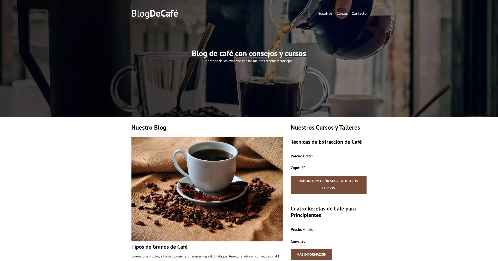

# Proyecto Blog de Café
En este proyecto estamos creando una Página Web totalmente responsive donde trabajamos únicamente la parte Front-End del sitio.

 

  

 

# Tecnologías utilizadas
 

## Mi nombre es Carlos López 👋🏾
### Software Developer

Me dedico al desarrollo software y en GitHub comparto todos los proyectos que he realizado hasta el momento. Mi objetivo es compartir con la comunidad mi progreso como programador y también mi conocimiento, por si pudiera ser de ayuda.

### Accede a mi perfil para más información

